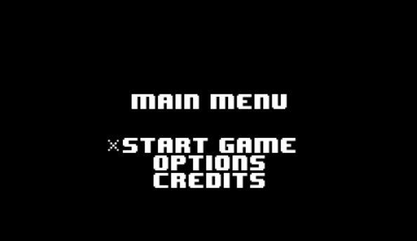
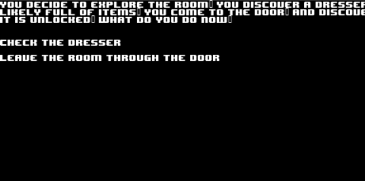
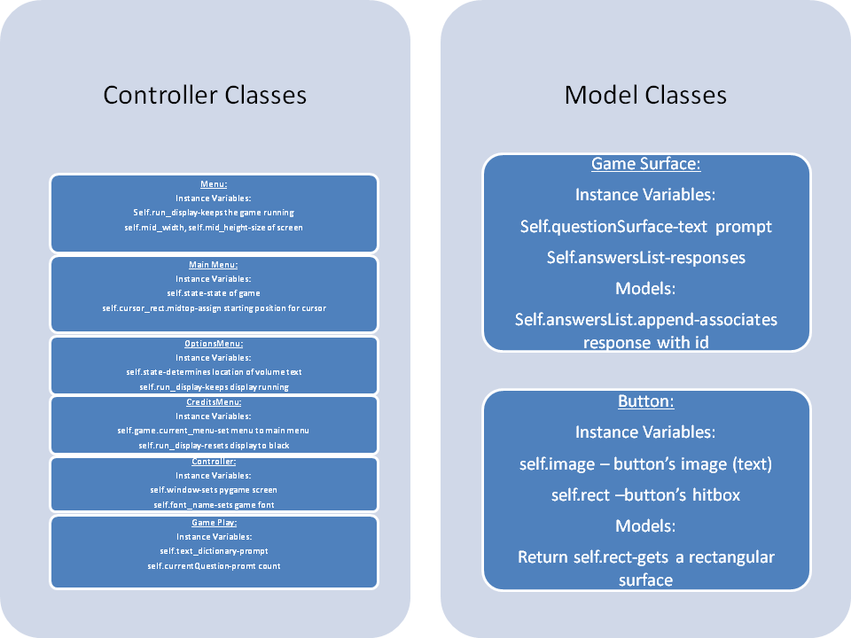

# CS110 Project Proposal
# Text Adventure With Graphical Output
## CS 110 Final Project
### Fall, 2022
### [Assignment Description](https://docs.google.com/document/d/1H4R6yLL7som1lglyXWZ04RvTp_RvRFCCBn6sqv-82ps/edit?usp=sharing)

### Replit Link ###
 [https://replit.com/join/fnrltzzdwg-ericpan7](#) 

### Demo Presentation###
 [https://docs.google.com/presentation/d/1mnorEOetZ_FMSyTntdMYwhMoutm2XhHn/edit?usp=sharing&ouid=114210175364490876890&rtpof=true&sd=true](#)

### Team:  Eric & Ivan 
#### Ivan Yun, Eric Pan

***

## Project Description

An adventure game with multiple outputs depending on the decisions of the user. The user is given a prompt, and is given a selection or responses to that prompt. Based on the reponses chosen, the user can experience a series of different prompts, responses, and endings.

***    

## User Interface Design

- **Initial Concept**
  - ***Start Menu***
   - Our initial concept would include a start menu, where multiple selections could be made, such as options, credits, quitting the program, and of course, starting the game. A graphic image or set of images were envisioned to be displayed on the start menu.

  - ***Gameplay Screen(s)***
   - Our gameplay screen initially consisted of a text box that would display a text prompt. This promt would explain to the user the current situation they were in, and how they may be able to respond. The user would then respond by typing in their response. A graphical output screen would display a visual representation of the prompt and the responses chosen by the user, mostly through the use of images.

   - The prompt and responses would use the same text box. As new prompts appeared and new responses were entered, older text would be pushed upwards, until disappearing from the top of the text box.

  - ***End Screen(s)***
   - Once the user entered a response that would lead to a game ending, an end screen would be displayed. A text prompt would display, explaining the ending that the user achived through gameplay. Based on the ending, the end screen would either indicate a victory or a game over. "Victory" or "Game Over" would accompany the end screen to fully indicate to the user the nature of their ending.

- **Final GUI**
    - ***Start Menu:***
    

   - This is the first screen that the user sees upon starting the program. They are presented with three options: Start Game, Options, and Credits.

   - Start game starts the game play. Options displays a options screen. However, this screen is entirely non-functional, as there are no options that the user can actually configure. Credits displays the credits of the game.
  
 - ***Gameplay Screen(s)***
  
  - This screen is an example of the multiple gameplay screens that the user will see. The exact screen that the user sees at any moment in the game depends on the decisions they make during gameplay.

  - A text prompt is displayed at the top of the screen. A list of possible responses are displayed underneath it. The user can select which response they wish to perform. Upon doing so, a new promt would be displayed based upon which response was chosen, along with new responses for that new prompt.

- ***End Screen(s)***
 
   - This is an example of an end screen. These screens are displayed before the end of the program, after the user chooses a response that leads to an ending. The end screen can either be a victory screen (if they win), or a game over screen (if they lose).

***        

## Program Design
* Non-Standard libraries
    * N/A (Not Applicable)
* Class Interface Design
         
* Classes
    *  Button Class: Creates clickable buttons
    *  GameSurface Class: Groups the question and answer on screen into a single class
    *  Gameplay Class: A gameplay class to play the game similar to the menu
    *  Menu Class: The Menu's default setup such as the display width & height, etc. It also draws (blits) the menu on screen.
    *  MainMenu Class: A menu class that includes the different states of the menu such as "Start", draws the different menu texts / options such as 'Main Menu', 'Start Game', 'Options', and 'Credits', it also keeps track of cursor movements with moving respectively with arrow keys (up & down). Finally it checks and changes the state of button depending on current state with respect to input.
    *  OptionsMenu Class: A selection for the user, includes Volume and Controls, does the same and checks for input and changes state similar to MainMenu Class. 
    *  CreditsMenu Class: Displays the credits of who made the game.
    *  Controller Class: Tracks players actions, includes canvas dimensions, setting font types, changing colors, references main menu, creates the play menu (to start the game), options, and credit menu. This class also is in charge of checking the events and resetting the keys, and finally drawing the font on the screen.

## Project Structure and File List

The Project is broken down into the following file structure:

* main.py
* src
    * controller.py
* assets
    * 8-BIT WONDER.TTF, class_diagram.jpg, storytext.json
* etc
    * extraoldcode.py, item.py, menu.py, milestone2.md, player.py, sample_controller.py, scene.py, text.py

***

## Tasks and Responsibilities 

   * We mainly worked on the project together.

## Testing

*Our testing consisted of running the code several times. As we encountered errors, we would determine where they originated, and then correct them.*

## ATP

| Step                 |Procedure             |Expected Results|Comments|                
|----------------------|:--------------------:|----------------------------------:|:-----|
|1| Open terminal, navigate to folder, and type, “python3 main.py”  |GUI window appears, "start game", "options", and "credits" options appear || |
|2| select "start game" option with keyboard| First prompt with responses appear|
|3| Select response with mouse left click on chosen response| Next prompt based off of previous response appears, with subsequent responses based off of new prompt|
|4| Final response is selected with keyboard| End screen is shown. If response leads to victory screen, show victory screen. If response leads to game over screen, show game over screen.|
|5| Once end screen is shown, user left clicks on mouse| Program ends